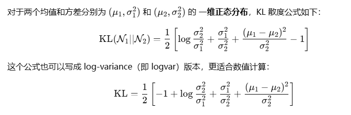
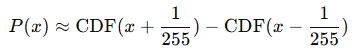
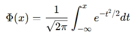
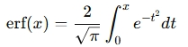
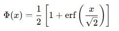
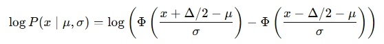
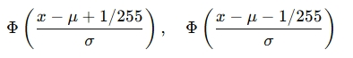

三个枚举类型，和 extract 函数，已经在 DDPM 中说过了，有变化的地方也已经写明了注释。

## 1. KL 散度计算

原本的 normal_kl 函数是写在 losses.py 文件里的。mean_flat 是写在 nn.py 文件里的。

normal_kl 它做了一些莫名奇妙的 tensor 转换工作，而且还是不完全版，仅对两个 log 方差做了 Tensor 对齐。但是实际上上游任务 q_posterior 和 p_mean_variance 的计算中，已经确保了这四个值是 tensor 类型，所以我将其换成了一个 assert 断言检查，看着更清爽一点。

KL 散度的计算，只和 return 有关，注释已经说明了，如果还是觉得有些难以理解，请看数学公式：



### 1.1 mean_flat

```py
tensor.mean(dim=list(range(1, len(tensor.shape))))
```

假设 tensor.shape = [B, C, H, W]，代表一组图像的 KL 散度值。

1. len([B, C, H, W]) = 4。
2. range(1, 4) 就是 [1, 2, 3], 数字代表下标索引，指的是 [C, H, W] 通道数、高、宽
3. tensor.mean(dim=[1, 2, 3]) 就表示在它的通道、高、宽上计算平均值
4. 最终输出是一个 [B] 的向量，每个元素是一个样本的“平均 KL 损失”。

## 2. 计算对数似然

discretized_gaussian_log_likelihood 和 approx_standard_normal_cdf 原本也是写在 losses.py 文件里的函数。

🧠 直觉目标：我们想估计 x 是从一个离散化高斯分布中采样得到的概率。

1. 原图 x 被归一化为 [-1, 1]；
2. 模型输出了一个 高斯分布：N(mean, scale^2)；
3. 但我们不能直接求连续高斯分布的 pdf（因为 x 是离散像素值）；
4. 所以我们估的是 像素值 x 附近的一个小区间落入该高斯分布的概率，即：



### 2.1 标准正态累积分布近似

原本的对数似然估计的计算中，cdf_plus 和 cdf_min 调用了这个函数：

```py
def approx_standard_normal_cdf(x):
    """ 标准正态累积分布函数的快速近似值。"""
    return 0.5 * (1.0 + th.tanh(np.sqrt(2.0 / np.pi) * (x + 0.044715 * th.pow(x, 3))))

# 传入的参数为：
plus_in = inv_stdv * (centered_x + 1.0 / 255.0)
min_in = inv_stdv * (centered_x - 1.0 / 255.0)
```

标准正态分布的 CDF 定义为：



由于这个积分没有解析解，计算起来较为复杂，因此在实际应用中常使用近似方法。而 approx_standard_normal_cdf 函数就是对标准正态分布的累积分布函数（CDF）的一种快速近似。

而我将 approx_standard_normal_cdf 函数换成了 torch.erf。它是 PyTorch 提供的误差函数（Error Function），定义为：



通过换算，也可以拟合标准正态分布的 CDF，并且更为精确：



当然，精确的代价就是计算速度在某些场景下会比 approx_standard_normal_cdf 中的 tanh 乘法慢一点，比如：

1. 进行大规模的高分辨率训练，且计算瓶颈恰好在 likelihood 处；
2. 做量化/蒸馏模型，对速度极致优化。

### 2.2 重建对数似然

我们需要进行计算的对数似然的完整公式：



🔹 Step 1：中心化并标准化输入：

把目标图 x 变成相对于高斯中心 means 的偏移（centered_x ），并将传入的 log 方差换成单位标准差，转换为倒数，方便后续相乘（inv_stdv）。

🔹 Step 2：求两个近邻的 CDF 值：

计算该离散像素上下界分别落入分布的 CDF 值，即：



```py
# 原本的 CDF 近似计算
cdf_plus = approx_standard_normal_cdf(plus_in)
cdf_min = approx_standard_normal_cdf(min_in)

# 现在的 CDF 近似计算
cdf_plus = 0.5 * (1.0 + th.erf(plus_in / math.sqrt(2))) # Φ(plus_in)
cdf_min = 0.5 * (1.0 + th.erf(min_in / math.sqrt(2)))   # Φ(min_in)
```

==具体请看 2.1 小节==

🔹 Step 3：边界情况分割处理（x ≈ -1 or x ≈ +1）：

对计算后的 CDF 进行 log 计算。clamp(min=1e-12) 是一个 **数值稳定性处理技巧**，尤其常见于概率和对数的计算中。

```py
log_cdf_plus = th.log(cdf_plus.clamp(min=1e-12))
```

比如在这里，如果 cdf_plus 非常非常小（甚至是 0），那么：log(0) = 负无穷，会导致 NaN（not a number） 或反向传播失效。所以 clamp(min=1e-12) 在这里的意思是，把 cdf_plus 中小于 1e-12 的值 截断为 1e-12，防止 log(0) 或极小值导致不稳定

🔹 Step 4：使用 torch.where 合并三种情况：

- 如果像素值 x 很小（≈ -1），就只用左边界概率 cdf_plus；
- 如果像素值 x 很大（≈ +1），就只用右边界概率 1 - cdf_min；
- 否则，使用取小区间 [x - 1/255, x + 1/255] 的概率 cdf_delta，这是正常情况。

where 判断中的 0.999 和 -0.999 是什么？它为什么是边界？

🧱 首先，图像是离散的

在扩散模型中，训练图像是从 uint8 的 [0, 255] 空间归一化到 [-1.0, 1.0] 的连续值：

x ∈ [-1.0, 1.0]，但实际只有 256 个可能值（离散像素）

每个像素表示一个宽度为：delta = 2.0 / 255 ≈ 0.0078

🎯 其次，我们其实想建模的是区间的概率

例如对 x = 1.0，我们真正关心的是它在 [(1 - 1/255), 1.0] 这个小区间内的概率，而不是“点概率”。

如果 x == 1.0，再加上 1/255 会越界（超出表示范围），所以：我们只取 x > 0.999 的那部分作为 “右边界情况”。同理，对左边 x < -0.999 也是类似的处理。

这是对像素离散化、边界保护的直观的理解。放在这里，并不是为了物理意义上的不能超过 1.0。回到第二节内容的最初公式，那里写着，CDF(x + 1/255)，但我们实际计算的时候，用的是 CDF(1/σ \* (x - mean + 1/255))。

换句话说，0.999 并不是界限的极限值，而是一个带缓冲的安全边界。0.999 与 1.0 只差约 0.001，比 1/255 ≈ 0.0039 还小一倍多，足以防止加上 1/255 后越界。

### 2.3 Python 的函数传参机制

在函数定义中出现 \* 时，它的意思是：从这一位置开始，后面的所有参数必须使用关键词方式（即 key=value）传递，而不能用位置参数传递。所以，means 和 log_scales 必须要使用 key=value 的方式传参，避免错误顺序传参。
