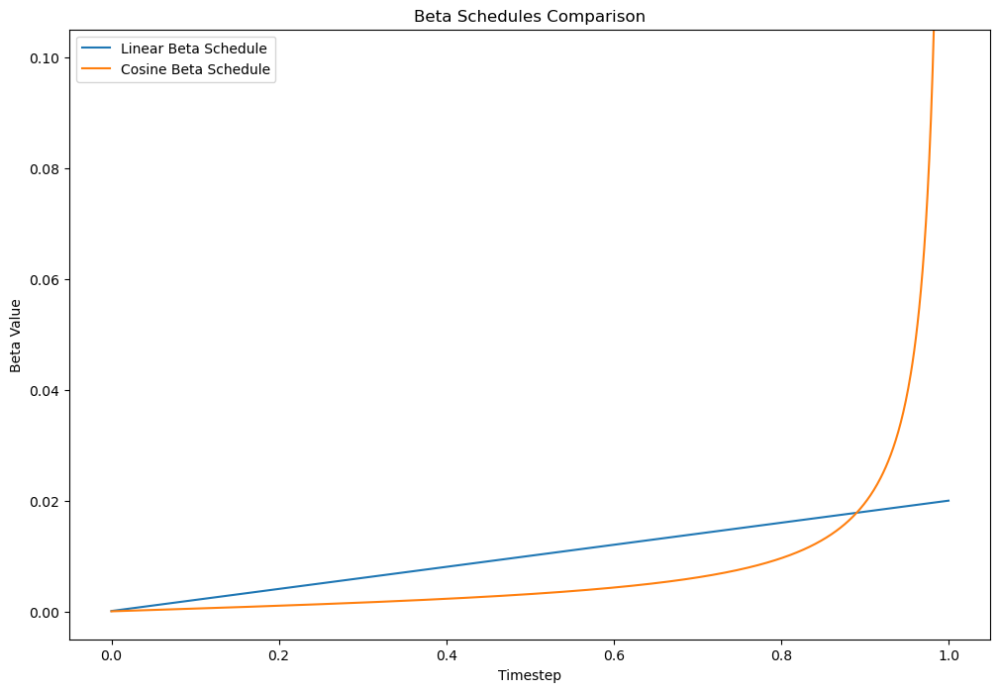
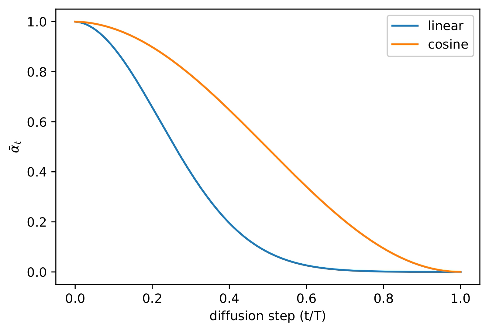
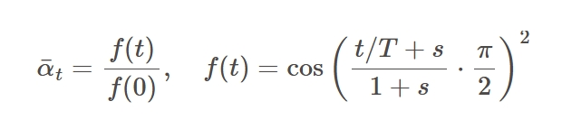

linear_beta_schedule 和 get_noise_schedule 在 DDPM 部分已经讲过了，看不懂的可以在我的仓库里找 Recode-DDPM。

## 1. linear 和 cosine 结果对比

IDM 的作者发现，线性的 beta 对于高分辨率图像效果不错，但对于低分辨率的图像表现不佳。原因是低分辨率图像包含的信息本身就不多，虽然一开始使用了比较小的 beta，但是线性的 schedule 对于这些低分辨率图像来说，加噪的速度还是太快。

所以他们采用了一种余弦的方式，定义了 beta 时间表，具体如下图所示：前期慢，后期快。

## 2. cosine_beta_schedule

但是从实现上来说，它并不是直接定义的 beta 序列，而是定义的 alpha_bar。回忆一下：

1. beta 表示噪声的强度
2. alpha = 1 - beta，表示图像除去噪声部分，所保留的面积
3. alpha_bar = alpha_0 \* alpha_1 \* ... \* alpha_t，表示累积下来的，保留有信息的部分。

这张图是论文中的原图，表示 alpha_bar 和 t 之间的关系。可以看出，余弦的加噪方案，对于信息的破坏更为缓慢。

### 2.1 代码解读

首先定义了一个 betas 列表，用于添加每一次余弦计算后的 beta。

接着计算 t1 = t，t2 = t + 1 这两个前后的时间步。在最后一步，计算 beta 时使用：min(1 - alpha_bar2 / alpha_bar1, max_beta)，数学公式上的理解是这样的：

只不过代码加了一个 max_beta=0.999 的比较，防止 beta 无限趋近于 1，导致出现问题。

而最后一步中的 alpha_bar1 和 alpha_bar2 的计算，所使用的公式为：

s 是计算时的较小的偏移量，如论文和代码中所述，为 0.008，防止 beta 在 t=0 附近过小。
