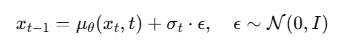
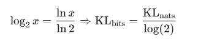
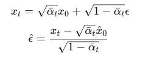
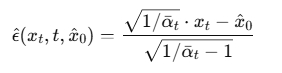
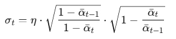
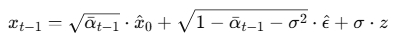
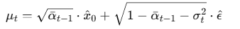
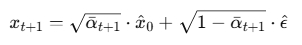

在 Python 中，类与类之间存在三种关系：依赖关系、组合关系、继承关系。IDM 使用了两种方式去做逆向生成的采样，一种是原始 DDPM，一种是加速采样的 DDIM。

我将两种不同的采样方法，定义在了新类 SamplerDDPM 和 SamplerDDIM 中，并用了组合的方式，将基类 GaussianDiffusion 封装到了两个采样对象的属性中。这样看起来结构清晰，并且未来拓展也变得更容易。

## 1. GaussianDiffusion

在这个基类对象中，我只保留了构造函数（beta 相关计算参数、传入的参数），和扩散、训练相关的函数。一些内容和 DDPM 一致，就不重复讲了，这里仅将不同的地方做一个说明。

### 1.1 q_mean_variance

这个函数是用来计算，在前向加噪过程中，真正的分布的计算。直觉上的理解：均值就是原始图像保留下的部分，方差就是逐步加入的高斯噪声。对比真实后验分布：

- q_mean_variance: 我如何丢失信息”，是可以直接计算出来的，不依赖模型。
- q_posterior: “我如何一步步找回信息”，依赖模型预测的噪声，以及从噪声推断出的 x_0。

### 1.2 p_mean_variance 方差

==首先说，FIXED_LARGE 和 FIXED_SMALL 这两个方差选择==。在我写的 DDPM 的构造中，FIXED_LARGE 代表的是真实后验方差，FIXED_SMALL 代表的是 betas 构建的方差。而 IDM 的定义反过来了，为什么？

从方差数组之间的间隔来说，betas 所代表的数组确实要比后验方差数组要密集，要小。但是 IDM 是从采样的多样性角度来分类的。在 DDPM 的采样步骤 p_sample 中，每一步我们都做类似这样的操作：

```py
# noise ~ N(0, I) 是随机采样的。
x_{t-1} = mean + sqrt(var) * noise
```

额外注入的噪声，是跟方差成正比的。所以本质上，多样性 == 采样噪声的影响力。

```py
# ➤ 使用 posterior_variance 时：
x_{t-1} = E[q(x_{t-1}|x_t, x_0)] + sqrt(posterior_var) * N(0, I)
```

这个 posterior_var 是严格根据 x_0 推导出来的真实分布。这时候采样基本“贴着真实轨迹走”。所以结果很稳定 → 生成图像几乎不变，多样性低。

```py
# ➤ 使用 beta_t（更小的 var）时：
x_{t-1} = E[...] + sqrt(beta_t) * N(0, I)
```

虽然 beta 比 posterior_var 小，但它跟采样噪声是独立组合的！它不是推导出来的真实后验，只是人为固定个数值，允许噪声多发挥一点作用。所以虽然 sqrt(beta) 更小，但整个过程和原始 q 不一致，会累积出不同的轨迹。

==其次就是 IDM 的一个重点，可学习方差 LEARNED 和 LEARNED_RANGE==。

当类型为 LEARNED 的时候，模型直接预测对数方差，不经过额外变换，所以我们看到：

```py
model_log_variance = model_var_values
model_variance = torch.exp(model_log_variance)
```

model_variance 取了一个 e 为底的指数函数，变回了普通方差。

LEARNED_RANGE 的部分，模型不要直接预测方差，而是预测一个 [-1, 1] 范围内的比例系数 frac，然后再插值得到实际对数方差：

1. min_log: 某个保底的方差下界，取自训练时 posterior 的 clipped log variance；
2. max_log: 上界，取的是 β_t 的 log；
3. model_var_values: 模型输出的值在 [-1, 1] 之间；
4. frac = (model_var_values + 1) / 2: 将其映射到 [0, 1]；
5. 然后做线性插值：



这个做法的优势是：数值更稳定（输出范围可控）；收敛更快，特别是在训练初期。

### 1.3 p_mean_variance 均值

这里需要注意的是，p_sample 每次采样都会调用 p_mean_variance 函数，所以相关的值都是单个的值，而不是一个序列。

PREVIOUS_X、START_X、EPSILON 三个值的预测都包裹了 process_xstart 函数，它就做了两件事，已经在注释中写明。

| 模型类型   | 模型预测 | 还原方式 | 预测均值                |
| ---------- | -------- | -------- | ----------------------- |
| PREVIOUS_X | x\_(t-1) | 反推 x_0 | 直接输出作为均值        |
| START_X    | x_0      | 无需反推 | 通过 q_posterior 计算 μ |
| EPSILON    | ϵ        | 反推 x_0 | 通过 q_posterior 计算 μ |

最后，返回的不只有 mean，还有 pred_xstart，所以每个判断里都计算了 pred_xstart。它是为了调试/可视化/损失计算保留下来的辅助变量。

### 1.4 \_vb_terms_bpd

大多数内容很容易理解，别的地方都有说到过。转换 KL 散度的单位为何要除以 np.log(2.0)：

```py
kl = mean_flat(kl) / np.log(2.0)
```

因为 KL 散度的单位是 nat（自然对数，底数是 e），但很多文献或评估指标更喜欢用 bit（底数是 2 的对数）。所以根据对数底变换公式，把每张图的 KL 损失从 nat 单位换算为 bit 单位：



normal_kl 和 mean_flat 函数详解请看 diffusion-utils.md 文件。对数自然估计的计算也一样。

关于最后一步 output 的计算，VLB（变分下界）在扩散模型中分解为多个 KL 散度之和（参考 DDPM 论文），其中最后一项就是是 解码器的负对数似然（NLL），用于评估从潜变量重建出图像的能力。

采样的时候是倒着来的，假如有 1000 步，第一步是 999，最后一步就是 0，所以在 t = 0 时我们不能再做 KL 了，x_0 本身就是原图像，没有后一个时间步，没有对应的先验分布和后验分布，此时只能直接评估生成样本 x_0 与真实图像的重合程度。

### 1.5 损失函数 training_losses

我在 DDPM 中的损失函数是这么写的：

```py
def p_losses(self, model, x_start, t, noise=None):

    if self.loss_type == LossType.MSE:
        self.loss_fn = nn.MSELoss()
    else:
        raise NotImplementedError("Only MSE loss is supported for now.")

    t = t.to(x_start.device)
    if noise is None:
        noise = torch.randn_like(x_start)

    x_t = self.q_sample(x_start, t, noise)  # 加噪音得到 x_t
    predicted_noise = model(x_t, t)  # 模型预测噪音

    return self.loss_fn(predicted_noise, noise)  # 计算损失
```

所以**第一段**很好理解，就是如果还没有噪声分布，第一次训练，那么就随机生成一个高斯分布噪声，然后丢进 q_sample 中计算，获得 x_t。model_kwargs 就是分类生成的标签。

**第二段**，loss_type 等于 KL 或者 RESCALED_KL 的时候，虽然看起来它写的很短，也没有调用 model 进行训练，但其实变分下界的计算中，调用了 p_mean_variance，等于调用了神经网络，层层套娃。

在 RESCALED_KL 的情况下额外有一个判断，KL 是逐时间步平均的原始的 MSE 损失未平均，如果要比较，需要乘上时间步数 T。也就是注释所写的 “loss 尺度跟 MSE 类型对齐”。

**第三段**：首先调用了 model 进行训练，这里的时间步也进行了缩放，是为了对齐线性噪声时间表的缩放（cosine 噪声时间表不用额外缩放），float 类型是因为 networkModel/utils 中的 timestep_embedding 使用的是 sinusoidal embedding，可以接受浮点数，没有问题。

之后是判断方差可学习，如果可学习，额外进行处理：

1. 首先将 3 通道的均值，和 3 通道的方差，也就是 model_output 和 model_var_values 分开
2. 然后用 detach() 断开均值的梯度传导，方差 model_var_values 保留，这样之后的 KL 计算，只会更新方差
3. 调用变分下界函数的第一个参数：model=lambda \*args, r=frozen_out: r。表示 “我懒得真的再调用模型了，我已经手里有结果了，就拿这个 r 当作模型的输出，继续下面的 KL/NLL 计算。”
4. 如果是 RESCALED_MSE，时间步数缩放过了，那么需要缩放回来。

这里真的有点绕，MSE 是直接计算均值的，目标是和真实值作比较。而方差，它是用来拟合真实的噪声方差分布的，所以它的计算要用高斯分布的似然函数，使用概率分布 KL/NLL 的公式计算。

terms 一共有三个值，一个 loss，一个 mse，一个 vb。当 loss_type 选择使用 KL 时，全靠变分下界 KL loss 来优化整个模型，所以它的输出直接就是 loss。而当使用 MSE 时，用 MSE 预测均值为主，用 KL 和 NLL 学习方差为辅，之后通过判断 vb 存不存在，决定 loss 是什么样子。

**最后两个点**，terms["mse"] 的计算本质上和调用 nn.MSELoss 方法是一样的，均方误差嘛，写法就是这么个写法，只不过它计算完 MSE，使用 mean_flat 将一整个 batch 的图像，拆解成单个的图像，做了平均。

loss 本质上就是 mean 和 var 一起计算的，不管是使用 MSE 也好，还是 KL 也好，我们的目标是最大化负对数似然估计，包含了均值分布和方差分布。原始的 DDPM 中使用了固定的方差，所以没什么感觉，这里多加了一个可学习的方差，看着多了，实际上是一样的。

## 2. SamplerDDPM

### 2.1 外部调用入口 sample

原本的 IDM 中这里应该是 p_sample_loop 函数，用了一个：

```py
for sample in self.p_sample_loop_progressive
```

的循环处理。这种写法是它把 p_sample_loop() 写成了一个 yield 的生成器（for sample in ...），而不是常规函数；所以这里用 for sample in ... 把每一帧 sample 接住，但只保留最后一个；这种做法的前提是 p_sample_loop 的每一步都 yield 了当前的图像——适合“逐步可视化”的场景，不适合最终生成图像场景。

所以我使用了自己的方式。

### 2.2 循环采样 p_sample_loop

这部分原本的函数是 p_sample_loop_progressive。noise=None 这个参数是为了后续扩展，如插值、修复可能会用到：

```py
if noise is not None:
    x_t = noise
else:
    x_t = torch.randn(shape, device=device)
```

如果为 None，就用 torch.randn(shape, device=device) 方法，创造一个和指定形状（shape）一样的纯噪声分布，我们目前用的就是这个。

progress=False 是一个进度条是否启用的判断参数，如果为 True，将 indices 用 tqdm 的进度条库包裹，为 False 则不启用进度条显示。还是蛮好用的，不想看进度条，选 False 就行了，也不碍事。保留！

之后写的调用 p_sample 函数的内容，和 DDPM 写的一致，就是多了几个参数。

### 2.3 单个 t 时刻的采样 p_sample

原本我的 DDPM 中是把所有的计算内容都写在这里了，但是 IDM 做了一个解耦，用 p_mean_variance 计算并返回：model_mean, model_variance, model_log_variance, pred_xstart 这四个值。他们不仅在采样中用了，在训练过程中损失计算也用了。

```py
noise = torch.randn_like(x_t)
nonzero_mask = ((t != 0).float().view(-1, *([1] * (len(x_t.shape) - 1))))
sample = out["mean"] + nonzero_mask * torch.exp(0.5 * out["log_variance"]) * noise

# sample = mean + std \* noise
```

这三个计算的重点是第三句，本质上就是从 x_t 到 x\_(t-1) 的高斯采样过程，用公式来表达是这样的：


1. 均值分布：mean = out["mean"]
2. 方差分布：std = torch.exp(0.5 \_ out["log_variance"])
3. 随机噪声：noise = torch.randn_like(x_t)

那么与方差分布和噪声相乘的 nonzero_mask 是什么？它是一个用于控制“是否添加噪声”的掩码张量，因为在最后一步（即 t=0），不应再加随机噪声。

假设 timesteps = 1000，采样的时候是倒数，t = [999, 998, ..., 1, 0]：

1. t != 0 会返回一个布尔张量，例如：[True, True, ..., True, False]
2. .float() 会把布尔转为浮点数：[1.0, 1.0, ..., 1.0, 0.0]
3. .view(-1, \*([1] \* (len(x_t.shape) - 1)))：
   - 假设 x_t 是形状 (B, C, H, W)，即 4 维；
   - 那么 len(x_t.shape) = 4，[1] \* 3 = [1, 1, 1]；
   - 所以 .view(-1, 1, 1, 1) 会把 (B,) 的向量 reshape 成 (B, 1, 1, 1)。

而因为最后一步 t=0，所以会 reshape 成 (B, 0, 0, 0)，这样相乘之后，等于不添加随机噪声了。

## 3. SamplerDDIM

### 3.1 predict_eps_from_xstart

这个函数写在基类 GaussianDiffusion 中的，但它只有 DDIM 用，所以就放这里写了。这个函数的作用是从 x_0 预测噪声，这一部分是从前向扩散加噪公式，反推而得到的。



从这个变换的方式来看，我们完全可以用 sqrt_alphas_cumprod 和 sqrt_one_minus_alphas_cumprod 这两个参数来计算 ε，为什么要分子分母同乘一个 根号下的 alphas_bar 分之一，将其转换为 sqrt_recip_alphas_cumprod 和 sqrt_recipm1_alphas_cumprod 呢？



sqrt_alphas_cumprod 和 sqrt_one_minus_alphas_cumprod 这两项，在 t 很小时（接近 0）或很大时（接近 1）会非常接近 0，容易引起浮点不稳定或分母为 0 的问题。

相比之下，倒数的写法，在数值上更加稳定且便于统一写法（尤其在实现 DDIM 推理那几个公式的时候）。

### 3.2 入口和循环采样

sample 是外部采样的调用入口，sample_loop 是循环采样，这两部分和 DDPM 的采样没什么区别。就是多了一个 eta 参数。这个参数是 DDIM 中的 可控噪声系数，在 ddim_sample 中的 sigma 计算时用到了：



DDIM 的采样过程实际上是一个通用公式，可以通过参数 η∈[0,1] 控制采样过程的“随机程度”：当 η=0：完全确定性采样（DDIM）；当 η=1：等价于原始 DDPM 的随机性采样。eta 就是这个 η。（论文中 Equation 16 的噪声标准差项）

### 3.3 ddim_sample

本质和 DDPM 的采样是一样的，最后都是计算 sample = mean + std \* noise，只不过中间的方法做了一些改变，mean、std 和 noise 全部重新做了计算。

论文中采样的核心大概是这么一个公式：



sigma 就是噪声分布的标准差 std，通过参数 η 控制最终采样的随机性；mean_pred 就是这个高斯分布的均值部分：



通过调用 p_mean_variance 返回字典中的值可以看出，pred_xstart 是核心，你只要预测出 x_bar_0，其余的 epsilon、mean、sigma 都能推出来。这使得 DDIM 非常方便支持多种模型结构，比如预测 x_bar_0、预测 ϵ、预测 velocity（如 SD 中的 v-prediction）等，都能转换到 DDIM 框架中统一采样。

### 3.4 ddim_reverse_sample

这是一个看起来没用上但其实有深意的函数，在 DDIM 的原始论文中，作者提出了确定性路径上的编码-解码对称性：

- 通常 DDPM 是从 x_0 --> x_t 随机加噪。
- 但在 DDIM 中，可以用一个确定性映射从 x_0 编码到 x_t，再反向走回 x_0。

这就是所谓的，非马尔可夫-确定性扩散过程（Non-Markovian, Deterministic Diffusion Process）。下面这个公式就是 mean_pred，也就是返回的 sample 值。



这就相当于是加噪声，但不再采样随机的 ε，而是使用模型自己估计的 ε。在训练图像编辑、图像插值、风格迁移等任务的“编码阶段”十分有用：

- 图像插值（interpolation）：从两张图像的 x_0 反推得到 x_t，然后在 latent 空间插值后再反向采样回图像；
- 图像编辑：将原图 x_0 编码为某个中间时间 x_t，在 latent 空间做一些修改，再生成图像；
- 风格迁移、CLIP-guided generation 等都可能用到这类“编码”步骤。
