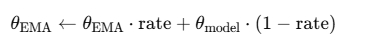

## 1. TrainLoop 构造函数

### 1.1 构造函数一

第一部分的大多数的参数都在 ymal 的 markdown 文件中解释过了，说一些里面有变化的：

- microbatch 就是最小 batch_size，它做了一个判断，如果小于 0 的话，就等于 batch_size。
- ema_rate 可以是多个值，如果是多个值就要写成字符串的形式，单值的话字符串、数值类型都可以。
- schedule_sampler 给了一个保底值 UniformSampler(diffusion)，如果没有传入的话。

### 1.2 构造函数二

状态变量初始化部分的 step，表示当前训练的步数（从 0 开始），如果断点恢复，会被覆盖成 resume_step，否则用于记录当前训练进度。

resume_step，如果从 checkpoint 加载模型，会设置这个值为加载时的步数，再赋值给 self.step。防止重复训练已经完成的步骤。

本来还有一个 global_batch，表示分布式训练下的“全局批次大小”。用不上，删了。

model_params 和 master_params，前者是获取当前模型的所有参数对象，方便后续操作（如优化器、梯度裁剪等），list() 是为了把参数 generator 变成显式列表。后者是在 FP16 的训练中，用 master_params 表示 FP32 的“主权重”。

lg_loss_scale 表示初始的 loss scale（缩放因子），用于 FP16 动态 loss scaling。

sync_cuda 就是检查 CUDA 是否可用，方便后续调用 GPU。

### 1.3 构造函数三

==\_load_and_sync_parameters== 这个函数原本是这么写的，主要内核是**断点恢复机制**：

```py
def _load_and_sync_parameters(self):
    resume_checkpoint = find_resume_checkpoint() or self.resume_checkpoint

    if resume_checkpoint:
        self.resume_step = parse_resume_step_from_filename(resume_checkpoint)
        if dist.get_rank() == 0:
            logger.log(f"loading model from checkpoint: {resume_checkpoint}...")
            self.model.load_state_dict(
                dist_util.load_state_dict(
                    resume_checkpoint, map_location=dist_util.dev()
                )
            )

    dist_util.sync_params(self.model.parameters())
```

==find_resume_checkpoint()== 它没有实现，返回的是 None。，作用是一个辅助函数，用于从默认目录中自动寻找最新的 checkpoint 文件（比如根据 checkpoint\_\*.pt 命名规则找最新的）。直接删除。而 self.resume_checkpoint 是一个从 yaml 文件中显示传入的路径，用这个做判断。

dist.get_rank()、dist_util.load_state_dict、dist_util.sync_params 全部都是分布式训练所使用的东西，一键删除。

dist_util.load_state_dict 这个函数返回的是一个 torch.load()，我们直接调用即可。它第一个参数原本使用的是 blobfile 去读取的文件路径，但是我们如果只用本地路径，是可以直接传入 resume_checkpoint 的。

调用的 ==parse_resume_step_from_filename== 这个函数，原本写的也是很冗余，我用 python 的正则库 re 重写了一遍。需要注意的是：

re.search(...) 返回的是一个 re.Match 类型的对象，里面存着所有匹配到的信息。group(0) 表示所匹配到的字符串，而 group(1) 包括 2、3、4 等等，需要看**正则表达式中有几个括号()**，它们表示 “捕获组”（capture group）中的内容。而我写的 (\d+) 只包含数字，所以只有一个 group(1) 表示捕获到的数字字符串。

==\_setup_fp16== 这个函数原始是这么写的：

```py
def _setup_fp16(self):
    self.master_params = make_master_params(self.model_params)
    self.model.convert_to_fp16()

def make_master_params(model_params):
    """ 原本写在 fp16_util 文件中，被我移动过来了"""
```

如果 use_fp16 为真，启用了 float16 精度计算，那么就使用 \_setup_fp16 函数，将 self.master_params 打造成一个干净、完整、安全的 32 精度的主参数副本，然后对神经网络模型，转换成 16 的精度。

```py
_flatten_dense_tensors([param.detach().float() for param in self.model_params])
```

✅ 首先，确保 master_params 不再跟原模型参数共享计算图（形容词：干净、安全的来源）

1. detach()：断开与原始参数的 autograd 依赖，这样做可以避免在训练时对原始模型造成副作用。
2. .float()：虽然很多时候已经是 float32，但这个转换可以 强制确保是全精度类型（以防模型初始化用了 float16，或混用了类型）。

✅ 其次，将所有参数“打平”合并为一个大 tensor（\_flatten_dense_tensors）

把多个小张量合成一个大 tensor，便于管理；加快更新速度（尤其是配合一些优化器时）；节省显存和提高带宽利用率。这在早期 AMP 实现中（特别是 NVIDIA 的 Apex）是标准做法。

```py
master_params = nn.Parameter(master_params)
master_params.requires_grad = True
self.master_params = [master_params]
self.model.convert_to_fp16()
```

1. nn.Parameter(): 把拼好的 tensor 转为可训练参数
2. 加入梯度
3. 最终返回一个列表（虽然只有一个元素）
4. 在神经网络中，将参数转换为 float16 精度进行计算

==self.opt== 参数优化器，Adam 和 AdamW 的差别在 weight decay 正则化的加入方式上。Adam 是直接加入到梯度当中的，而 AdamW 直接在权重上进行衰减，在收敛速度上也能领先于 Adam。但是我们默认权重衰减为 0，等于没有用。

传入的模型参数是 master_params，为什么，因为更新参数用 32 浮点精度来做还是稳妥，如果启用了 FP16 进行训练，直接对 FP16 参数更新容易丢失精度（数值太小会 underflow）。

📌 训练流程简图：

```text
FP16 / 16 model (前向 & 反向)
       ↓
FP32 master_params (update 优化器)
       ↓
把更新结果同步回 model 的参数
```

所以不管我们用什么精度训练，参数优化器中的更新操作，锁死 FP32。

### 1.4 构造函数四

如果断点轮次数 resume_step 存在，首先使用 ==\_load_optimizer_state== 函数加载 model000000.pt 所对应的 opt000000.pt 参数优化器文件，加载对应的参数到神经网络中。

然后使用 ==\_load_ema_parameters== 函数加载对应的 ema_0.9999_000000.pt 文件，0.9999 表示 rate，它是一个列表形式，虽然默认 ymal 中写的是 "0.9999"，也可以加入更多，"0.999, 0.9999, 0.99999"，不同的 rate 会有独立的检查点文件。

两个函数的写法和 ==\_load_and_sync_parameters== 基本一致，ema 的函数多了一些内容：

```py
ema_params = copy.deepcopy(self.master_params)
```

它先对 self.master_params 进行了一个深度拷贝，如果后续的 ema_checkpoint 不存在，也可以用 master_params 作为初始 EMA 参数，不会报错；如果存在的话，则从中恢复 EMA 参数并转换为 master 参数格式：

```py
# 4.2.1 将加载的 state_dict（通常来自 EMA 检查点）转为 master 参数格式
def _state_dict_to_master_params(self, state_dict):
    params = [state_dict[name] for name, _ in self.model.named_parameters()]
    if self.use_fp16:
        return make_master_params(params)
    else:
        return params
```

✅ 这段代码对参数顺序的正确性非常依赖（因为 state_dict 是 dict，没有顺序），所以使用 named_parameters() 是一种非常可靠的做法。

之后的判断是，若启用了 FP16 模式，则将参数转为 float32 并展平为单个 nn.Parameter； 否则，直接返回参数列表。返回值格式与 self.master_params 一致，便于直接赋值或用于 EMA。

==make_master_params==这个函数在 **构造函数三** 中提过了。

### 1.5 构造函数五

这里原本是一个条件判断，多卡训练相关的，使用了 DDP，我们不用，直接删除。

## 2. TrainLoop 主循环 run_loop

主循环函数内的代码很好理解，我已经写了注释了，主要是嵌套的函数比较多，其次就是这个循环结束条件写的有点让人懵逼。lr_anneal_steps 不是叫的学习率退火吗，让学习率逐渐缩小变为 0，为什么这里反而成了循环结束的终止条件呢？

其实不然，它即控制了训练的整个长度，也用于 “线性学习率退火”，在 ==\_anneal_lr== 函数中有写明计算过程，“退火结束”的时刻，也恰好是“训练终止”的时刻。

训练的核心是 ==run_step== 函数，这个函数中调用了三种方法：

1. forward_backward：前向传播、反向传播，是重中之重
2. 如果用 FP16 训练，就用 optimize_fp16 函数，否则使用 optimize_normal 函数
3. log_step

### 2.1 forward_backward

这一块真的很有意思，microbatch 的意义在于，它允许你 **逻辑上** 用大 batch size 训练，但 **物理上** 分多步在小显存里完成。

我记得我在哪里写过，batch_size 的范围最好是在 [16, 64] 这个范围内，因为我们要==计算多个样本的平均梯度来更新模型==，如果梯度较小，比如 8，甚至 4，就会造成：梯度估计噪声大，收敛慢，或者不稳定，模型性能下降等等问题。

✅ 而 microbatch 的策略是：比如你原本希望用 batch_size=64 来训练，但你的显存最多只能塞下 16 张图，通过迷你 batch 的切分之后：

1. 每次只用 16 张图做 forward + backward → 显存够用；
2. 累积了 4 次梯度之后，等价于用 64 张图做一次更新 → 模型性能更好；
3. 相当于 “模拟” 了一个大 batch 的训练。

然后要说的是 ==functools.partial==，注释已经解释了它用来绑定训练的损失函数，并传入参数。但是为什么要这么做呢？为什么就不能直接调用呢？下面这一段原本的 IDM 代码就是原因：

```py
if last_batch or not self.use_ddp:
    losses = compute_losses()
else:
    with self.ddp_model.no_sync():
        losses = compute_losses()
```

partial() 是为了提前绑定部分参数，返回一个“可以延迟调用”的函数句柄，方便在后面统一调用。使用场景的核心思路是：

- 有时候这个函数 training_losses(...) 被不同地方调用；
- 有时候它被传入别的函数作为“回调函数”；
- 有时候我们要 延迟执行（不是立刻执行，而是等一会儿再执行）；
- 有时候我们需要把一些值提前绑定（比如 model 和样本），再统一使用。

🧩 举个实际例子，上面的那段代码，如果 losses 直接等于 self.diffusion.training_losses(...)，并且传入了参数，那就直接执行了；

但是 compute_losses = functools.partial(...) 它只会绑定好参数，但是不执行，直到调用了 losses = compute_losses() 的时候才执行。

在 多卡（DDP）训练中，每次 .backward() 默认会 同步所有卡上的梯度。但是如果你在做 梯度累积（microbatch），前几步其实 不需要同步，只需要最后一个 microbatch 再同步。所以在这里才出现了这个条件判断：

1. last_batch 为 True → 才同步
2. 否则 no_sync() → 临时关闭同步，节省通信/显存

然后是 ==log_loss_dict== 函数，这个辅助函数很有用：

```py
for key, values in losses.items():
    logger.logkv_mean(key, values.mean().item())
```

损失函数返回的 losses 是一个字典，包含了 "loss", "mse", "kl", "vb" 这些值，key 就是这些值的名称，values 就是对应每个样本的 loss，是一个 shape=[batch_size] 的张量。

values.mean().item() 用于计算当前这个 batch 的平均 loss，然后用日志工具中写的 logkv_mean 函数记录整个 batch 的平均 loss 值，供后续 logger 聚合或输出。

```py
for sub_t, sub_loss in zip(ts.cpu().numpy(), values.detach().cpu().numpy()):
    quartile = int(4 * sub_t / diffusion.num_timesteps)
    logger.logkv_mean(f"{key}_q{quartile}", sub_loss)
```

第二段 for 循环用来记录按时间步划分的 loss 分布：

1. ts: 是每个样本对应的时间步（timestep）
2. sub_t: 是每个样本的时间步索引（0 ~ T-1）
3. quartile: 将时间步划分为 4 段（quartile），[0, 0.25], [0.25, 0.5], [0.5, 0.75], [0.75, 1]，这四个区间的值，乘以 4 再用 int 取整，就变成了 0，1，2，3 这四个值。

不管是 improved-diffusion 还是 guided-diffusion，只要跑过训练就可以看到类似这样的日志，每个样本的 loss 都归入了对应的「时间分区」：

```makefile
| loss       | 0.0268   |
| loss_q0    | 0.0801   |
| loss_q1    | 0.00568  |
| loss_q2    | 0.00125  |
| loss_q3    | 0.000204 |
```

这些按时间步区域聚合的 loss，可以帮助你判断在哪一段时间分布上模型学得不好。

这一部分的最后一个内容，FP16 的情况下为什么要放大 loss？lg_loss_scale 的值为什么是 20？

```py
if self.use_fp16:
    loss_scale = 2 ** self.lg_loss_scale
    (loss * loss_scale).backward()
```

在使用 FP16（半精度浮点数）时，最大的风险是梯度下溢（underflow），也就是很多梯度变成了 0，模型学不动。FP32 最小可表示值 ≈ 1e-38，而 FP16 最小可表示值 ≈ 1e-5。

loss 本身就是在一直减小的，甚至在 初始阶段的梯度传播过程中，loss 本身还不算小的时候，某些中间层的梯度都可能会非常小，所以就需要构造一个缩放值。

之所以选择 2^20 = 1,048,576 这个缩放值，文件的开头定义 INITIAL_LOG_LOSS_SCALE 的时候就解释了：

1. 在初始阶段，loss 很小，系统检测到梯度精度过低
2. 所以动态 loss scaling 会自动提高 lg_loss_scale
3. 最终稳定在 lg_loss_scale ≈ 20~21，也就是 loss_scale ≈ 1~2 百万

### 2.2 优化器更新

两个函数，一个是 ==optimize_fp16==，一个是 ==optimize_normal==。前者是 FP16，做了一些额外处理，后者是正常情况下的更新，核心步骤是执行 optimizer.step()，也就是 self.opt.step()。

先说 ==optimize_normal== 吧，里面的方法 FP16 当中也有，而且没有变。首先使用 ==\_log_grad_norm== 函数记录梯度范数：

```py
def _log_grad_norm(self):
    # 初始化变量 sqsum，用于累计所有参数梯度平方的总和。
    sqsum = 0.0
    # 遍历 FP32 主参数
    for p in self.master_params:
        # 每个参数的梯度张量，按元素平方再求和，相当于计算它的 L2 范数的平方
        # .item()：把张量转换为 Python 数值。然后累计追加到 sqsum 中。
        sqsum += (p.grad ** 2).sum().item()
    # 最终得到所有参数梯度的 全局 L2 范数 np.sqrt(sqsum)，并记录为 grad_norm
    logger.logkv_mean("grad_norm", np.sqrt(sqsum))
```

- grad_norm 过大，可能表示梯度爆炸，需要减小学习率或加 gradient clipping。
- grad_norm 过小（趋近于 0）：可能表示梯度消失，尤其是使用 FP16 时就容易下溢。
- 长期不变：模型可能卡住或优化器状态未更新。

```py
def _anneal_lr(self):
    # 如果 lr_anneal_steps 为 0 或 None，跳过退火，使用固定的学习率
    if not self.lr_anneal_steps:
        return
    # 当前进度：训练到现在为止完成了多少比例（浮点数）
    frac_done = (self.step + self.resume_step) / self.lr_anneal_steps
    # 学习率线性下降：从初始学习率 self.lr 下降到 0
    lr = self.lr * (1 - frac_done)
    # 修改优化器中所有参数组的学习率，这一步是 PyTorch，
    # 设置学习率的标准方式（optimizer 中可以有多个 param group）
    for param_group in self.opt.param_groups:
        param_group["lr"] = lr
```

**线性退火**不是下降到一个最小值，而是严格 线性衰减到 0。先大步走，越靠近目标越小心，简单有效，训练稳定。

```py
for rate, params in zip(self.ema_rate, self.ema_params):
    update_ema(params, self.master_params, rate=rate)
```

ema_rate 可以是多个值，ema_params 是对应多个 ema_rate 的参数集。所以我们要先进行一个循环，取出一个 rate 和对应的一组 params，在 ==update_ema== 函数中更新 ema_params 使其更接近 master_params。

```py
def update_ema(target_params, source_params, rate=0.99):
    for targ, src in zip(target_params, source_params):
        targ.detach().mul_(rate).add_(src, alpha=1 - rate)
```

📌 这一行做了如下操作（完全 in-place，避免产生新张量）：



1. targ.detach()：防止梯度传播到 target 上（targ 通常是 register buffer 或 clone 后的参数）。
2. mul\_(rate)：目标值乘以 rate（也就是保留原来的比例）。
3. add\_(src, alpha=1 - rate)：再加上 (1 - rate) 倍的源参数。

==optimize_fp16== 的部分，属于手动 FP16，也就是手动维护 master weights：

```py
if any(not th.isfinite(p.grad).all() for p in self.model_params):
    self.lg_loss_scale -= 1
    logger.log(f"Found NaN, decreased lg_loss_scale to {self.lg_loss_scale}")
    return
```

这一步属于核心步骤，如果梯度中出现 NaN/Inf，说明 loss scale 太大；减小 lg_loss_scale（指数地降低浮点数范围）；跳过这个 batch 的更新，防止训练崩掉。

然后就是从模型训练的 FP16，使用 ==model_grads_to_master_grads== 函数转化为 FP32，进行 optimizer 更新，然后再用 ==master_params_to_model_params== 函数转回 FP16，扔给模型做训练。

前者在前面说过，我们主要说转回 FP16 这部分函数：

```py
def master_params_to_model_params(model_params, master_params):
    model_params = list(model_params)
    for param, master_param in zip(
        model_params, unflatten_master_params(model_params, master_params)
    ):
        param.detach().copy_(master_param)
```

model_params 先对自己做一个 list(), 是为了确保 model_params 是可重复遍历的列表，兼容传进来的是生成器或非列表的 iterable 情况。

假设我们传进来的是一个生成器，（<generator object>），生成器一旦遍历就会“耗尽”，不能再次使用。如果我们不显式转成 list，在下面这句循环里，model_params 被 zip 使用一次之后，就不能在 unflatten_master_params 里再次用它的长度或结构了。

这个循环啊，param 对应 model_params，master_param 对应 unflatten_master_params(model_params, master_params)。

unflatten_master_params 将 FP32 的主参数 master_params “拆包”（unflatten）为原来每一层的形状。然后把它们 复制（in-place） 回 FP16 的 model_params 中。

写回的操作 detach() 是为了避免梯度追踪，copy\_(master_param) 表示原地写入 FP16 的 param（即模型中实际运行的参数）。

### 2.3 模型、优化器、EMA 状态的保存
